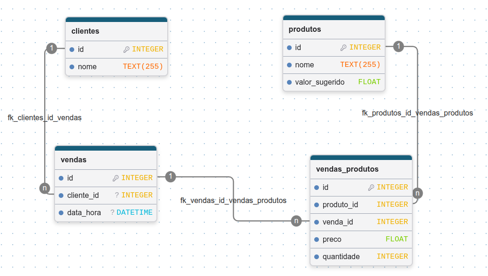

# Aula — Sistema de Lanchonete com Python e Banco de Dados

## Índice

- [Aula 1 — Contexto, conexão com `.env` e criação das tabelas](#aula-1--contexto-conexão-com-env-e-criação-das-tabelas)
- [Aula 2 — Cadastrando e buscando clientes e produtos com Python](#aula-2--cadastrando-e-buscando-clientes-e-produtos-com-python)

---

# Aula 1 — Contexto, conexão com `.env` e criação das tabelas

## Objetivo da aula

Nesta aula, vamos criar a primeira parte de um sistema de lanchonete usando Python e PostgreSQL.

O sistema será conectado a um banco de dados real na internet.

Desde o início, vamos usar um arquivo `.env` para guardar os dados de conexão com o banco. Assim, a Aula 1 e a Aula 2 ficam coerentes e usam a mesma forma de configuração.

Ao final da aula, você deverá conseguir:

- criar um projeto em Python;
- instalar as bibliotecas necessárias;
- criar um arquivo `.env` com os dados do banco;
- criar um arquivo `.gitignore` para proteger o `.env`;
- testar a conexão com o PostgreSQL;
- criar as tabelas do sistema da lanchonete.

---

## 1. Contexto do sistema

Vamos imaginar uma lanchonete que precisa registrar suas vendas.

A lanchonete possui:

- clientes;
- produtos;
- vendas;
- produtos vendidos em cada venda.

Exemplo:

    Cliente: Ana

    Venda:
    - 2 coxinhas
    - 1 refrigerante

Para organizar essas informações, vamos usar quatro tabelas:

    clientes
    produtos
    vendas
    vendas_produtos

---

## 2. Entendendo as tabelas

### Diagrama do banco

O diagrama do banco é o seguinte:

---

### Tabela clientes

A tabela `clientes` guarda as pessoas que compram na lanchonete.

Campos:

    id
    nome

Exemplo:

    id | nome
    1  | Ana
    2  | Bruno
    3  | Carlos

---

### Tabela produtos

A tabela `produtos` guarda os produtos vendidos pela lanchonete.

Campos:

    id
    nome
    valor_sugerido

Exemplo:

    id | nome          | valor_sugerido
    1  | Coxinha       | 6.50
    2  | Refrigerante  | 5.00
    3  | Pastel        | 8.00

---

### Tabela vendas

A tabela `vendas` guarda o registro de que uma venda aconteceu.

Campos:

    id
    cliente_id
    data_hora

Exemplo:

    id | cliente_id | data_hora
    1  | 1          | 2026-06-02 10:30:00

Importante:

    cliente_id indica qual cliente fez a compra.

Ou seja, a venda não guarda diretamente o nome da pessoa. Ela guarda o ID do cliente.

---

### Tabela vendas_produtos

A tabela `vendas_produtos` guarda os produtos que fazem parte de uma venda.

Campos:

    id
    produto_id
    venda_id
    preco
    quantidade

Exemplo:

    id | produto_id | venda_id | preco | quantidade
    1  | 1          | 1        | 6.50  | 2
    2  | 2          | 1        | 5.00  | 1

Explicação:

    A tabela vendas diz que uma venda aconteceu.

    A tabela vendas_produtos diz quais produtos foram comprados nessa venda.

---

## 3. Criando a pasta do projeto

Crie uma pasta chamada:

    lanchonete-python

Dentro dessa pasta, crie três arquivos:

    .env
    .gitignore
    main.py

A estrutura ficará assim:

    lanchonete-python/
        .env
        .gitignore
        main.py

Nesta versão da aula, não vamos usar `config.py`. Todas as configurações do banco ficarão no arquivo `.env`.

---

## 4. Instalando as bibliotecas necessárias

Abra o terminal dentro da pasta do projeto e execute:

    pip install psycopg[binary] python-dotenv

Vamos usar duas bibliotecas:

    psycopg

Permite que o Python se conecte ao banco PostgreSQL.

    python-dotenv

Permite que o Python leia as configurações salvas no arquivo `.env`.

---

## 5. Criando o arquivo `.env`

Abra o arquivo `.env` e coloque os dados de conexão com o banco.

Exemplo:

    DB_HOST=SEU_HOST_AQUI
    DB_PORT=12345
    DB_NAME=defaultdb
    DB_USER=SEU_USUARIO_AQUI
    DB_PASSWORD=SUA_SENHA_AQUI
    DB_SSLMODE=require

O professor irá informar os dados corretos do banco.

Explicação dos campos:

    DB_HOST      -> endereço do servidor do banco
    DB_PORT      -> porta de conexão
    DB_NAME      -> nome do banco de dados
    DB_USER      -> usuário do banco
    DB_PASSWORD  -> senha do banco
    DB_SSLMODE   -> modo de conexão segura

---

## 6. Por que usamos o arquivo `.env`?

O arquivo `.env` serve para guardar configurações importantes do sistema, como endereço do banco, usuário, senha, porta e nome do banco.

Essas informações não devem ficar escritas diretamente dentro do código Python, porque são dados sensíveis.

Se o projeto for enviado para o GitHub ou para outro repositório Git com a senha dentro do código, outras pessoas podem conseguir acessar o banco de dados.

Por isso, usamos o `.env` para separar as configurações secretas do código principal.

---

## 7. Criando o arquivo `.gitignore`

Crie um arquivo chamado:

    .gitignore

Dentro dele, coloque:

    .env
    __pycache__/
    *.pyc

O arquivo `.gitignore` informa ao Git quais arquivos ou pastas devem ser ignorados.

O mais importante aqui é:

    .env

Assim, o arquivo com a senha do banco não será enviado para o repositório.

---

## 8. Testando a conexão com o banco

Abra o arquivo `main.py` e coloque este código:

    import os
    import psycopg
    from dotenv import load_dotenv

    load_dotenv()

    def conectar():
        conexao = psycopg.connect(
            host=os.getenv("DB_HOST"),
            port=os.getenv("DB_PORT"),
            dbname=os.getenv("DB_NAME"),
            user=os.getenv("DB_USER"),
            password=os.getenv("DB_PASSWORD"),
            sslmode=os.getenv("DB_SSLMODE")
        )

        return conexao

    def testar_conexao():
        try:
            conexao = conectar()
            print("Conexão realizada com sucesso!")
            conexao.close()
        except Exception as erro:
            print("Erro ao conectar no banco:")
            print(erro)

    testar_conexao()

Agora execute o programa no terminal:

    python main.py

Resultado esperado:

    Conexão realizada com sucesso!

Se aparecer erro, verifique:

- se a internet está funcionando;
- se o arquivo `.env` existe;
- se os nomes das variáveis estão corretos;
- se o host está correto;
- se a porta está correta;
- se o usuário está correto;
- se a senha está correta;
- se o banco está ativo;
- se as bibliotecas foram instaladas.

---

## 9. Entendendo o código de conexão

Este trecho carrega as variáveis do arquivo `.env`:

    load_dotenv()

Depois disso, podemos buscar os valores usando `os.getenv()`:

    os.getenv("DB_HOST")
    os.getenv("DB_USER")
    os.getenv("DB_PASSWORD")

Assim, a senha do banco não fica escrita diretamente no código.

---

## 10. Criando a tabela clientes

Agora vamos criar a primeira tabela do sistema.

Substitua o conteúdo do arquivo `main.py` por este código:

    import os
    import psycopg
    from dotenv import load_dotenv

    load_dotenv()

    def conectar():
        conexao = psycopg.connect(
            host=os.getenv("DB_HOST"),
            port=os.getenv("DB_PORT"),
            dbname=os.getenv("DB_NAME"),
            user=os.getenv("DB_USER"),
            password=os.getenv("DB_PASSWORD"),
            sslmode=os.getenv("DB_SSLMODE")
        )

        return conexao

    def criar_tabela_clientes():
        conexao = conectar()
        cursor = conexao.cursor()

        cursor.execute("""
            CREATE TABLE IF NOT EXISTS clientes (
                id SERIAL PRIMARY KEY,
                nome VARCHAR(255) NOT NULL
            );
        """)

        conexao.commit()
        cursor.close()
        conexao.close()

        print("Tabela clientes criada com sucesso.")

    criar_tabela_clientes()

Execute:

    python main.py

Resultado esperado:

    Tabela clientes criada com sucesso.

---

## 11. Explicando o código da tabela clientes

Este comando cria a tabela:

    CREATE TABLE IF NOT EXISTS clientes

Significa:

    Crie a tabela clientes se ela ainda não existir.

Este campo cria um código automático:

    id SERIAL PRIMARY KEY

Significa:

    Cada cliente terá um ID único.

Este campo cria o nome do cliente:

    nome VARCHAR(255) NOT NULL

Significa:

    O nome será um texto obrigatório.

---

## 12. Criando todas as tabelas

Agora vamos criar todas as tabelas do sistema.

Substitua o conteúdo do arquivo `main.py` por este código completo:

    import os
    import psycopg
    from dotenv import load_dotenv

    load_dotenv()

    def conectar():
        conexao = psycopg.connect(
            host=os.getenv("DB_HOST"),
            port=os.getenv("DB_PORT"),
            dbname=os.getenv("DB_NAME"),
            user=os.getenv("DB_USER"),
            password=os.getenv("DB_PASSWORD"),
            sslmode=os.getenv("DB_SSLMODE")
        )

        return conexao

    def criar_tabela_clientes():
        conexao = conectar()
        cursor = conexao.cursor()

        cursor.execute("""
            CREATE TABLE IF NOT EXISTS clientes (
                id SERIAL PRIMARY KEY,
                nome VARCHAR(255) NOT NULL
            );
        """)

        conexao.commit()
        cursor.close()
        conexao.close()

        print("Tabela clientes criada com sucesso.")

    def criar_tabela_produtos():
        conexao = conectar()
        cursor = conexao.cursor()

        cursor.execute("""
            CREATE TABLE IF NOT EXISTS produtos (
                id SERIAL PRIMARY KEY,
                nome VARCHAR(255) NOT NULL,
                valor_sugerido NUMERIC(10, 2) NOT NULL
            );
        """)

        conexao.commit()
        cursor.close()
        conexao.close()

        print("Tabela produtos criada com sucesso.")

    def criar_tabela_vendas():
        conexao = conectar()
        cursor = conexao.cursor()

        cursor.execute("""
            CREATE TABLE IF NOT EXISTS vendas (
                id SERIAL PRIMARY KEY,
                cliente_id INTEGER NOT NULL,
                data_hora TIMESTAMP DEFAULT CURRENT_TIMESTAMP,

                CONSTRAINT fk_clientes_id_vendas
                    FOREIGN KEY (cliente_id)
                    REFERENCES clientes(id)
            );
        """)

        conexao.commit()
        cursor.close()
        conexao.close()

        print("Tabela vendas criada com sucesso.")

    def criar_tabela_vendas_produtos():
        conexao = conectar()
        cursor = conexao.cursor()

        cursor.execute("""
            CREATE TABLE IF NOT EXISTS vendas_produtos (
                id SERIAL PRIMARY KEY,
                produto_id INTEGER NOT NULL,
                venda_id INTEGER NOT NULL,
                preco NUMERIC(10, 2) NOT NULL,
                quantidade INTEGER NOT NULL,

                CONSTRAINT fk_produtos_id_vendas_produtos
                    FOREIGN KEY (produto_id)
                    REFERENCES produtos(id),

                CONSTRAINT fk_vendas_id_vendas_produtos
                    FOREIGN KEY (venda_id)
                    REFERENCES vendas(id)
            );
        """)

        conexao.commit()
        cursor.close()
        conexao.close()

        print("Tabela vendas_produtos criada com sucesso.")

    def criar_todas_as_tabelas():
        criar_tabela_clientes()
        criar_tabela_produtos()
        criar_tabela_vendas()
        criar_tabela_vendas_produtos()

        print("Todas as tabelas foram criadas.")

    criar_todas_as_tabelas()

Execute o programa:

    python main.py

Resultado esperado:

    Tabela clientes criada com sucesso.
    Tabela produtos criada com sucesso.
    Tabela vendas criada com sucesso.
    Tabela vendas_produtos criada com sucesso.
    Todas as tabelas foram criadas.

---

## 13. Entendendo as chaves estrangeiras

Observe este trecho:

    FOREIGN KEY (cliente_id)
    REFERENCES clientes(id)

Isso significa:

    O campo cliente_id da tabela vendas aponta para o campo id da tabela clientes.

Exemplo:

    clientes

    id | nome
    1  | Ana

    vendas

    id | cliente_id
    1  | 1

Nesse exemplo, a venda pertence à cliente Ana.

---

## 14. Por que existe a tabela vendas_produtos?

Uma venda pode ter vários produtos.

Exemplo:

    Venda 1:
    - 2 coxinhas
    - 1 refrigerante
    - 1 suco

Se colocássemos os produtos diretamente na tabela `vendas`, ficaria difícil organizar.

Por isso usamos a tabela `vendas_produtos`.

Ela permite registrar vários produtos dentro da mesma venda.

---

## 15. Por que o preço aparece em vendas_produtos?

A tabela `produtos` tem o campo:

    valor_sugerido

Mas a tabela `vendas_produtos` tem o campo:

    preco

Isso acontece porque o preço pode mudar no momento da venda.

Exemplo:

    Coxinha cadastrada com valor sugerido: R$ 6.50

    Mas em uma promoção, ela pode ser vendida por: R$ 5.00

Por isso o sistema salva o preço usado naquela venda.

---

## 16. Conferindo se deu certo

Se tudo deu certo, o banco agora possui quatro tabelas:

    clientes
    produtos
    vendas
    vendas_produtos

Essas tabelas formam a estrutura inicial do sistema da lanchonete.

---

## 17. Exercícios

Responda no caderno ou em um arquivo de texto:

1. Para que serve a tabela `clientes`?
2. Para que serve a tabela `produtos`?
3. Para que serve a tabela `vendas`?
4. Para que serve a tabela `vendas_produtos`?
5. O que significa `PRIMARY KEY`?
6. O que significa `FOREIGN KEY`?
7. Por que a tabela `vendas` tem o campo `cliente_id`?
8. Por que a tabela `vendas_produtos` tem o campo `produto_id`?
9. Por que usamos `NUMERIC(10, 2)` para valores em dinheiro?
10. Qual é a diferença entre `valor_sugerido` e `preco`?
11. Para que serve o arquivo `.env`?
12. Por que o arquivo `.env` deve ficar no `.gitignore`?

---

## 18. Desafio extra

Explique com suas palavras o que acontece neste exemplo:

    clientes

    id | nome
    1  | Ana

    produtos

    id | nome          | valor_sugerido
    1  | Coxinha       | 6.50
    2  | Refrigerante  | 5.00

    vendas

    id | cliente_id
    1  | 1

    vendas_produtos

    id | venda_id | produto_id | preco | quantidade
    1  | 1        | 1          | 6.50  | 2
    2  | 1        | 2          | 5.00  | 1

Pergunta:

    Quem comprou?
    Quais produtos foram comprados?
    Qual foi o total da venda?

---

## 19. Resumo da Aula 1

Nesta aula, aprendemos que:

- o Python pode se conectar a um banco de dados real;
- o arquivo `.env` guarda as configurações do banco;
- o arquivo `.gitignore` evita que o `.env` seja enviado ao Git;
- uma tabela organiza informações de um tipo;
- uma chave primária identifica cada registro;
- uma chave estrangeira liga uma tabela a outra;
- uma venda pode ter vários produtos;
- o banco da lanchonete precisa de várias tabelas para organizar bem os dados.

---

# Aula 2 — Cadastrando e Buscando Clientes e Produtos com Python

## Continuação da Aula 1

Na aula anterior, criamos a estrutura do banco de dados da lanchonete.

Também configuramos o projeto usando:

    .env
    .gitignore
    main.py

E criamos quatro tabelas:

    clientes
    produtos
    vendas
    vendas_produtos

Nesta aula, vamos continuar usando a mesma estrutura com `.env`.

Agora vamos começar a inserir e consultar informações no banco usando Python.

Também vamos melhorar a organização do código usando:

- funções que recebem parâmetros;
- funções de processo para lidar com o `input()` do usuário;
- busca com filtro opcional por nome;
- menu simples no terminal.

---

## 1. Objetivo da aula

Ao final desta aula, você deverá conseguir:

- inserir clientes no banco;
- inserir produtos no banco;
- buscar todos os clientes;
- buscar clientes pelo nome;
- buscar todos os produtos;
- buscar produtos pelo nome;
- criar um menu simples no terminal;
- separar funções de banco de funções de interação com o usuário.

---

## 2. Estrutura do projeto

Verifique se você ainda tem a pasta criada na aula anterior:

    lanchonete-python

Dentro dela, devem existir estes arquivos:

    .env
    .gitignore
    main.py

A estrutura deve ficar assim:

    lanchonete-python/
        .env
        .gitignore
        main.py

Importante: nesta aula, continuaremos usando o `.env` criado na Aula 1. Não é necessário criar `config.py`.

---

## 3. Conferindo as bibliotecas necessárias

Na Aula 1, instalamos:

    pip install psycopg[binary] python-dotenv

Se você já fez isso, não precisa instalar novamente.

Se estiver em outro computador ou em uma pasta nova, execute novamente:

    pip install psycopg[binary] python-dotenv

---

## 4. Conferindo o arquivo `.env`

Antes de continuar, confira se o arquivo `.env` ainda existe.

Ele deve estar assim:

    DB_HOST=SEU_HOST_AQUI
    DB_PORT=12345
    DB_NAME=defaultdb
    DB_USER=SEU_USUARIO_AQUI
    DB_PASSWORD=SUA_SENHA_AQUI
    DB_SSLMODE=require

O professor irá informar os dados corretos do banco.

---

## 5. Começando o arquivo `main.py`

Abra o arquivo `main.py`.

Substitua o conteúdo dele por este código inicial:

    import os
    import psycopg
    from dotenv import load_dotenv

    load_dotenv()

    def conectar():
        conexao = psycopg.connect(
            host=os.getenv("DB_HOST"),
            port=os.getenv("DB_PORT"),
            dbname=os.getenv("DB_NAME"),
            user=os.getenv("DB_USER"),
            password=os.getenv("DB_PASSWORD"),
            sslmode=os.getenv("DB_SSLMODE")
        )

        return conexao

Esse código faz a conexão com o banco usando os dados do arquivo `.env`, da mesma forma que fizemos na Aula 1.

---

## 6. Testando a conexão novamente

Antes de continuar, vamos testar se a conexão ainda está funcionando.

Adicione esta função no arquivo `main.py`:

    def testar_conexao():
        try:
            conexao = conectar()
            print("Conexão realizada com sucesso!")
            conexao.close()
        except Exception as erro:
            print("Erro ao conectar no banco:")
            print(erro)

No final do arquivo, coloque:

    testar_conexao()

O arquivo ficará assim:

    import os
    import psycopg
    from dotenv import load_dotenv

    load_dotenv()

    def conectar():
        conexao = psycopg.connect(
            host=os.getenv("DB_HOST"),
            port=os.getenv("DB_PORT"),
            dbname=os.getenv("DB_NAME"),
            user=os.getenv("DB_USER"),
            password=os.getenv("DB_PASSWORD"),
            sslmode=os.getenv("DB_SSLMODE")
        )

        return conexao

    def testar_conexao():
        try:
            conexao = conectar()
            print("Conexão realizada com sucesso!")
            conexao.close()
        except Exception as erro:
            print("Erro ao conectar no banco:")
            print(erro)

    testar_conexao()

Execute no terminal:

    python main.py

Resultado esperado:

    Conexão realizada com sucesso!

Se aparecer erro, verifique:

- se o arquivo `.env` existe;
- se os nomes das variáveis estão corretos;
- se o host está correto;
- se a porta está correta;
- se o usuário está correto;
- se a senha está correta;
- se o banco está ativo;
- se a biblioteca `python-dotenv` foi instalada.

---

## 7. Separando melhor as funções

Nesta aula, vamos organizar o código em dois tipos de funções.

### Funções de banco

São funções que fazem operações no banco.

Exemplos:

    cadastrar_cliente(nome)
    buscar_clientes(nome=None)
    cadastrar_produto(nome, valor_sugerido)
    buscar_produtos(nome=None)

Essas funções recebem parâmetros e não pedem dados com `input()`.

---

### Funções de processo

São funções que conversam com o usuário pelo terminal.

Exemplos:

    processo_cadastrar_cliente()
    processo_listar_clientes()
    processo_cadastrar_produto()
    processo_listar_produtos()

Essas funções usam `input()`, chamam as funções de banco e mostram mensagens na tela.

---

## 8. Por que separar desse jeito?

Observe esta função:

    def cadastrar_cliente(nome):

Ela recebe o nome como parâmetro.

Isso significa que essa função não precisa saber de onde veio o nome.

O nome poderia vir:

- do teclado;
- de uma página web;
- de um aplicativo;
- de uma planilha;
- de outro sistema.

Por enquanto, o nome virá do `input()`, mas quem fará isso será outra função:

    def processo_cadastrar_cliente():

Essa separação deixa o código mais organizado.

---

## 9. Função para cadastrar cliente

Remova a linha final:

    testar_conexao()

Agora adicione esta função:

    def cadastrar_cliente(nome):
        conexao = conectar()
        cursor = conexao.cursor()

        cursor.execute("""
            INSERT INTO clientes (nome)
            VALUES (%s);
        """, (nome,))

        conexao.commit()
        cursor.close()
        conexao.close()

        print("Cliente cadastrado com sucesso.")

Essa função recebe o nome como parâmetro:

    cadastrar_cliente(nome)

Exemplo de uso:

    cadastrar_cliente("Ana")

---

## 10. Função de processo para cadastrar cliente

Agora adicione a função que pede o nome pelo terminal:

    def processo_cadastrar_cliente():
        nome = input("Digite o nome do cliente: ")

        cadastrar_cliente(nome)

Essa função faz duas coisas:

1. pede o nome do cliente;
2. chama a função `cadastrar_cliente(nome)`.

---

## 11. Testando o cadastro de cliente

No final do arquivo, coloque:

    processo_cadastrar_cliente()

Execute:

    python main.py

Digite um nome, por exemplo:

    Ana

Resultado esperado:

    Cliente cadastrado com sucesso.

Depois, execute novamente e cadastre outros clientes:

    Bruno
    Carlos
    Mariana

---

## 12. Função para buscar clientes

Agora vamos criar uma função para buscar clientes no banco.

Ela poderá funcionar de duas formas:

    buscar_clientes()

Busca todos os clientes.

    buscar_clientes("ana")

Busca clientes que tenham “ana” no nome.

Adicione a função:

    def buscar_clientes(nome=None):
        conexao = conectar()
        cursor = conexao.cursor()

        if nome is None or nome == "":
            cursor.execute("""
                SELECT id, nome
                FROM clientes
                ORDER BY id;
            """)
        else:
            cursor.execute("""
                SELECT id, nome
                FROM clientes
                WHERE nome ILIKE %s
                ORDER BY id;
            """, (f"%{nome}%",))

        clientes = cursor.fetchall()

        cursor.close()
        conexao.close()

        return clientes

---

## 13. Entendendo o `nome=None`

Na função:

    def buscar_clientes(nome=None):

O parâmetro `nome` é opcional.

Se a função for chamada assim:

    buscar_clientes()

O valor de `nome` será:

    None

Então o sistema entende que deve buscar todos os clientes.

Se a função for chamada assim:

    buscar_clientes("ana")

O valor de `nome` será:

    "ana"

Então o sistema entende que deve buscar clientes com esse texto no nome.

---

## 14. Entendendo o filtro com `ILIKE`

Este trecho faz a busca pelo nome:

    WHERE nome ILIKE %s

O `ILIKE` é parecido com o `LIKE`, mas ele não diferencia letras maiúsculas e minúsculas.

Exemplo:

    ana

Pode encontrar:

    Ana
    Mariana
    Ana Clara

Este trecho:

    (f"%{nome}%",)

coloca o texto digitado entre `%`.

Exemplo:

    nome = "ana"

Vira:

    "%ana%"

Isso significa:

    Encontre nomes que tenham "ana" em qualquer parte.

---

## 15. Função de processo para listar clientes

Agora vamos criar a função que pergunta se o usuário quer filtrar por nome e mostra o resultado na tela.

Adicione:

    def processo_listar_clientes():
        nome = input("Digite parte do nome do cliente ou pressione ENTER para listar todos: ")

        clientes = buscar_clientes(nome)

        print("\n--- Clientes cadastrados ---")

        if len(clientes) == 0:
            print("Nenhum cliente encontrado.")
            return

        for cliente in clientes:
            print(f"{cliente[0]} - {cliente[1]}")

---

## 16. Testando a busca de clientes

No final do arquivo, troque para:

    processo_listar_clientes()

Execute:

    python main.py

Teste primeiro pressionando ENTER sem digitar nada.

Resultado esperado:

    --- Clientes cadastrados ---
    1 - Ana
    2 - Bruno
    3 - Carlos
    4 - Mariana

Agora execute novamente e digite:

    ana

Resultado possível:

    --- Clientes cadastrados ---
    1 - Ana
    4 - Mariana

---

## 17. Função para cadastrar produto

Agora vamos criar a função para cadastrar produtos.

Adicione:

    def cadastrar_produto(nome, valor_sugerido):
        conexao = conectar()
        cursor = conexao.cursor()

        cursor.execute("""
            INSERT INTO produtos (nome, valor_sugerido)
            VALUES (%s, %s);
        """, (nome, valor_sugerido))

        conexao.commit()
        cursor.close()
        conexao.close()

        print("Produto cadastrado com sucesso.")

Essa função recebe dois parâmetros:

    nome
    valor_sugerido

Exemplo de uso:

    cadastrar_produto("Coxinha", 6.50)

---

## 18. Função de processo para cadastrar produto

Agora adicione a função que pede os dados do produto no terminal:

    def processo_cadastrar_produto():
        nome = input("Digite o nome do produto: ")
        valor_sugerido = float(input("Digite o valor sugerido: "))

        cadastrar_produto(nome, valor_sugerido)

---

## 19. Atenção ao valor do produto

Quando o programa pedir o valor, use ponto em vez de vírgula.

Use assim:

    6.50

Não use assim:

    6,50

Em Python, números decimais usam ponto.

---

## 20. Testando o cadastro de produtos

No final do arquivo, coloque:

    processo_cadastrar_produto()

Execute:

    python main.py

Cadastre alguns produtos:

    Coxinha
    6.50

    Refrigerante
    5.00

    Pastel
    8.00

    Suco
    7.00

    Pão de queijo
    4.50

---

## 21. Função para buscar produtos

Agora vamos criar uma função para buscar produtos.

Ela também aceitará filtro opcional por nome.

Adicione:

    def buscar_produtos(nome=None):
        conexao = conectar()
        cursor = conexao.cursor()

        if nome is None or nome == "":
            cursor.execute("""
                SELECT id, nome, valor_sugerido
                FROM produtos
                ORDER BY id;
            """)
        else:
            cursor.execute("""
                SELECT id, nome, valor_sugerido
                FROM produtos
                WHERE nome ILIKE %s
                ORDER BY id;
            """, (f"%{nome}%",))

        produtos = cursor.fetchall()

        cursor.close()
        conexao.close()

        return produtos

Essa função funciona de duas formas:

    buscar_produtos()

Busca todos os produtos.

    buscar_produtos("co")

Busca produtos que tenham “co” no nome.

---

## 22. Função de processo para listar produtos

Agora adicione a função que mostra os produtos na tela:

    def processo_listar_produtos():
        nome = input("Digite parte do nome do produto ou pressione ENTER para listar todos: ")

        produtos = buscar_produtos(nome)

        print("\n--- Produtos cadastrados ---")

        if len(produtos) == 0:
            print("Nenhum produto encontrado.")
            return

        for produto in produtos:
            print(f"{produto[0]} - {produto[1]} - R$ {produto[2]}")

---

## 23. Testando a busca de produtos

No final do arquivo, coloque:

    processo_listar_produtos()

Execute:

    python main.py

Teste pressionando ENTER sem digitar nada.

Resultado esperado:

    --- Produtos cadastrados ---
    1 - Coxinha - R$ 6.50
    2 - Refrigerante - R$ 5.00
    3 - Pastel - R$ 8.00
    4 - Suco - R$ 7.00
    5 - Pão de queijo - R$ 4.50

Agora execute novamente e digite:

    co

Resultado possível:

    --- Produtos cadastrados ---
    1 - Coxinha - R$ 6.50

---

## 24. Criando o menu

Agora vamos criar um menu para o usuário escolher o que deseja fazer.

Adicione esta função:

    def menu():
        while True:
            print("\n=== Sistema da Lanchonete ===")
            print("1 - Cadastrar cliente")
            print("2 - Listar ou buscar clientes")
            print("3 - Cadastrar produto")
            print("4 - Listar ou buscar produtos")
            print("0 - Sair")

            opcao = input("Escolha uma opção: ")

            if opcao == "1":
                processo_cadastrar_cliente()

            elif opcao == "2":
                processo_listar_clientes()

            elif opcao == "3":
                processo_cadastrar_produto()

            elif opcao == "4":
                processo_listar_produtos()

            elif opcao == "0":
                print("Encerrando o sistema...")
                break

            else:
                print("Opção inválida.")

No final do arquivo, deixe apenas:

    menu()

---

## 25. Código completo da Aula 2

Ao final da aula, o arquivo `main.py` deve ficar assim:

    import os
    import psycopg
    from dotenv import load_dotenv

    load_dotenv()

    def conectar():
        conexao = psycopg.connect(
            host=os.getenv("DB_HOST"),
            port=os.getenv("DB_PORT"),
            dbname=os.getenv("DB_NAME"),
            user=os.getenv("DB_USER"),
            password=os.getenv("DB_PASSWORD"),
            sslmode=os.getenv("DB_SSLMODE")
        )

        return conexao

    def cadastrar_cliente(nome):
        conexao = conectar()
        cursor = conexao.cursor()

        cursor.execute("""
            INSERT INTO clientes (nome)
            VALUES (%s);
        """, (nome,))

        conexao.commit()
        cursor.close()
        conexao.close()

        print("Cliente cadastrado com sucesso.")

    def buscar_clientes(nome=None):
        conexao = conectar()
        cursor = conexao.cursor()

        if nome is None or nome == "":
            cursor.execute("""
                SELECT id, nome
                FROM clientes
                ORDER BY id;
            """)
        else:
            cursor.execute("""
                SELECT id, nome
                FROM clientes
                WHERE nome ILIKE %s
                ORDER BY id;
            """, (f"%{nome}%",))

        clientes = cursor.fetchall()

        cursor.close()
        conexao.close()

        return clientes

    def cadastrar_produto(nome, valor_sugerido):
        conexao = conectar()
        cursor = conexao.cursor()

        cursor.execute("""
            INSERT INTO produtos (nome, valor_sugerido)
            VALUES (%s, %s);
        """, (nome, valor_sugerido))

        conexao.commit()
        cursor.close()
        conexao.close()

        print("Produto cadastrado com sucesso.")

    def buscar_produtos(nome=None):
        conexao = conectar()
        cursor = conexao.cursor()

        if nome is None or nome == "":
            cursor.execute("""
                SELECT id, nome, valor_sugerido
                FROM produtos
                ORDER BY id;
            """)
        else:
            cursor.execute("""
                SELECT id, nome, valor_sugerido
                FROM produtos
                WHERE nome ILIKE %s
                ORDER BY id;
            """, (f"%{nome}%",))

        produtos = cursor.fetchall()

        cursor.close()
        conexao.close()

        return produtos

    def processo_cadastrar_cliente():
        nome = input("Digite o nome do cliente: ")

        cadastrar_cliente(nome)

    def processo_listar_clientes():
        nome = input("Digite parte do nome do cliente ou pressione ENTER para listar todos: ")

        clientes = buscar_clientes(nome)

        print("\n--- Clientes cadastrados ---")

        if len(clientes) == 0:
            print("Nenhum cliente encontrado.")
            return

        for cliente in clientes:
            print(f"{cliente[0]} - {cliente[1]}")

    def processo_cadastrar_produto():
        nome = input("Digite o nome do produto: ")
        valor_sugerido = float(input("Digite o valor sugerido: "))

        cadastrar_produto(nome, valor_sugerido)

    def processo_listar_produtos():
        nome = input("Digite parte do nome do produto ou pressione ENTER para listar todos: ")

        produtos = buscar_produtos(nome)

        print("\n--- Produtos cadastrados ---")

        if len(produtos) == 0:
            print("Nenhum produto encontrado.")
            return

        for produto in produtos:
            print(f"{produto[0]} - {produto[1]} - R$ {produto[2]}")

    def menu():
        while True:
            print("\n=== Sistema da Lanchonete ===")
            print("1 - Cadastrar cliente")
            print("2 - Listar ou buscar clientes")
            print("3 - Cadastrar produto")
            print("4 - Listar ou buscar produtos")
            print("0 - Sair")

            opcao = input("Escolha uma opção: ")

            if opcao == "1":
                processo_cadastrar_cliente()

            elif opcao == "2":
                processo_listar_clientes()

            elif opcao == "3":
                processo_cadastrar_produto()

            elif opcao == "4":
                processo_listar_produtos()

            elif opcao == "0":
                print("Encerrando o sistema...")
                break

            else:
                print("Opção inválida.")

    menu()

---

## 26. Executando o programa final

No terminal, execute:

    python main.py

O menu deve aparecer:

    === Sistema da Lanchonete ===
    1 - Cadastrar cliente
    2 - Listar ou buscar clientes
    3 - Cadastrar produto
    4 - Listar ou buscar produtos
    0 - Sair
    Escolha uma opção:

Teste todas as opções.

---

## 27. Atividade prática

Cadastre pelo menos 3 clientes:

    Ana
    Bruno
    Mariana

Cadastre pelo menos 5 produtos:

    Coxinha - 6.50
    Refrigerante - 5.00
    Pastel - 8.00
    Suco - 7.00
    Pão de queijo - 4.50

Depois, teste as buscas.

Busque clientes usando:

    ana
    bru
    mar

Busque produtos usando:

    co
    re
    su

---

## 28. Perguntas para responder

Responda no caderno ou em um arquivo de texto:

1. Para que serve o arquivo `.env`?
2. Por que o arquivo `.env` não deve ser enviado para o Git?
3. Para que serve o arquivo `.gitignore`?
4. Para que serve o comando `INSERT INTO`?
5. Para que serve o comando `SELECT`?
6. O que o comando `commit()` faz?
7. Por que usamos `%s` dentro do comando SQL?
8. O que a função `fetchall()` retorna?
9. O que significa `nome=None` na função `buscar_clientes(nome=None)`?
10. Qual é a diferença entre `buscar_clientes()` e `buscar_clientes("ana")`?
11. Para que serve o `ILIKE`?
12. Por que usamos uma função `processo_cadastrar_cliente()` separada da função `cadastrar_cliente(nome)`?
13. Qual é a vantagem de passar parâmetros para uma função?
14. O que acontece quando o usuário pressiona ENTER sem digitar um nome na busca?
15. O que acontece quando o usuário escolhe a opção `0` no menu?

---

## 29. Desafio extra

Adicione uma busca de produtos por valor máximo.

Exemplo:

    Digite o valor máximo: 6.00

Resultado esperado:

    Produtos com valor até R$ 6.00

Dica de SQL:

    SELECT id, nome, valor_sugerido
    FROM produtos
    WHERE valor_sugerido <= %s
    ORDER BY valor_sugerido;

---

## 30. Resumo da Aula 2

Nesta aula, aprendemos que:

- o Python pode inserir dados no banco;
- o Python pode buscar dados no banco;
- podemos passar parâmetros para funções;
- podemos criar parâmetros opcionais usando `None`;
- podemos usar `ILIKE` para buscar parte de um texto;
- continuamos usando o arquivo `.env` criado na Aula 1;
- separar funções de banco e funções de processo deixa o código mais organizado.

Na próxima aula, vamos registrar uma venda escolhendo um cliente e adicionando produtos vendidos.
